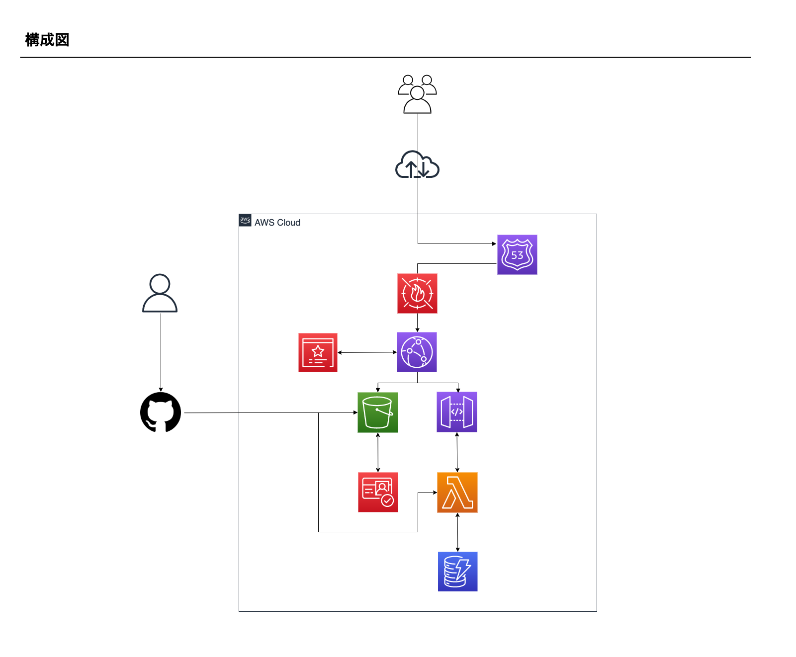

# my-site-terraform

## 概要

自分のWEBサイト環境を構築するTerraformコードです。

## 構成図



## ディレクトリ構成

```
.
├── cloud_front_function # SPA+S3用のパス処理用関数
├── example_code # 初回デプロイ時に使用するコード集
└── terraform # Terraformコード
```

## その他

### 関連リポジトリ

- フロント: [Gompei/my-site](https://github.com/Gompei/my-site)
- api: [Gompei/my-site-api](https://github.com/Gompei/my-site-api)
- インフラ: [Gompei/my-site-terraform](https://github.com/Gompei/my-site-terraform)